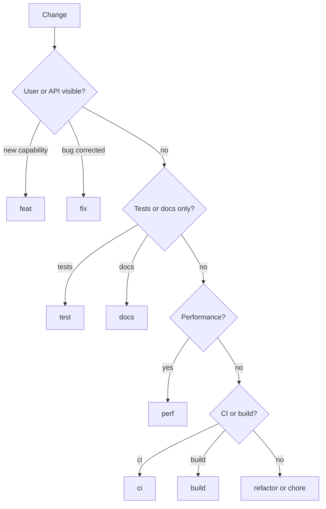

# Conventional Commits Reference

Companion to `SKILL.md`. Load when choosing type, scope, or validating against commitlint.

## Header Format

```text
<type>[optional scope][optional !]: <description>

[optional body]

[optional footer(s)]
```

- **type** (required): what kind of change
- **scope** (optional): area affected, e.g. package or module name
- **!** (optional): signals breaking change when footer omitted
- **description** (required): short summary, imperative mood, lowercase, no trailing period

## Allowed Types

| Type | When to use |
|------|-------------|
| `feat` | New user-facing capability or API |
| `fix` | Bug fix for users or production behavior |
| `docs` | Documentation only |
| `style` | Formatting, whitespace; no logic change |
| `refactor` | Code change that is neither feat nor fix |
| `perf` | Performance improvement |
| `test` | Adding or correcting tests |
| `build` | Build system, bundler, dependencies |
| `ci` | CI/CD config and scripts |
| `chore` | Maintenance, tooling, non-user-facing housekeeping |
| `revert` | Reverts a prior commit |

## Type Selection



**Breaking changes:** use `!` after type/scope **and** a `BREAKING CHANGE:` footer describing migration impact.

Triggers for breaking:
- Removed or renamed public export
- Changed function signature consumers rely on
- Changed default behavior without opt-in

## Scope Inference

In multi-package repos, infer scope from the folder structure:

| Repo pattern | Scope source | Example |
|--------------|--------------|---------|
| Monorepo `packages/*` | package folder name | `nes-image-utils` |
| App repos | feature area or top-level module | `plp`, `checkout` |
| Single-package repo | omit scope or use repo shorthand | `fix: resolve login redirect` |

Read `packages/<folder>/package.json` `name` field when publishing context matters; use folder name for scope in commits.

## Subject Line Rules

| Rule | Target | commitlint default |
|------|--------|-------------------|
| Mood | imperative ("add" not "added") | — |
| Case | lowercase start | subject-case |
| Length | ≤50 chars (skill target) | header-max-length 100 |
| Punctuation | no trailing period | subject-full-stop: never |
| Empty | not allowed | subject-empty: false |

## Body and Footer

- Blank line between header and body (`body-leading-blank`)
- Blank line before footers (`footer-leading-blank`)
- Use bullet list when multiple logical changes in one commit
- Footer format: `TOKEN: value` (e.g. `BREAKING CHANGE:`, `Refs: JIRA-123`)

## commitlint (@commitlint/config-conventional)

Repos extend this via `.commitlintrc.js`. Default rules the message must pass:

| Rule | Value |
|------|-------|
| type-enum | feat, fix, docs, style, refactor, perf, test, build, ci, chore, revert |
| type-case | lowerCase |
| type-empty | false |
| scope-case | lowerCase |
| subject-empty | false |
| subject-full-stop | never |
| header-max-length | 100 |
| body-leading-blank | always |
| footer-leading-blank | always |

If repo has custom `.commitlintrc.js`, read and apply overrides.

## Examples

### 1. Single bugfix

```text
fix(nes-image-utils): correct webp fallback url

- Use CDN constant instead of hardcoded path
```

### 2. Multi-file feature

```text
feat(nes-widgets): add banner lazy-load support

- Add intersection observer hook in Image component
- Export LAZY_LOAD_THRESHOLD from BannerV2 constants
```

### 3. Breaking API change

```text
refactor(nes-image-utils)!: remove deprecated resize helper

- Drop getLegacyResizeUrl from public index

BREAKING CHANGE: getLegacyResizeUrl is no longer exported. Use getResizeUrl instead.
```

### 4. Chore / maintenance

```text
chore(nes-image-utils): bump package version for release
```

## Anti-Patterns

| Bad | Why | Fix |
|-----|-----|-----|
| `Fixed bug` | no type, capitalized | `fix(scope): describe bug` |
| `feat: stuff` | vague subject | imperative, specific |
| `fix(nes-image-utils): fixed the image.` | trailing period | remove period |
| Breaking removal without footer | consumers unaware | add `BREAKING CHANGE:` |
| `WIP` / `temp` | not conventional | use proper type or don't commit |
