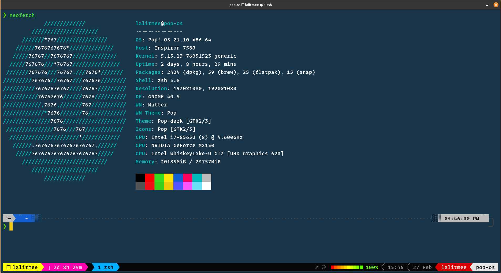
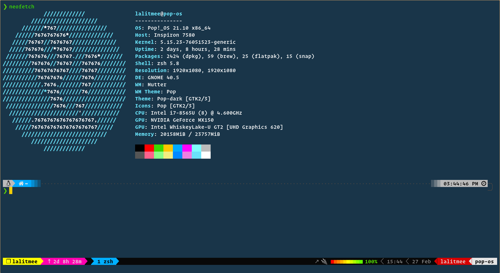

# dotfiles

All of my dotfiles are here. 👍

## Branches

Sometimes I face some issues with neovim buitin lsp, that's why I manintain two
branches for `coc.nvim` and `lspconfig.nvim`

- [lsp/coc.nvim](https://github.com/lalitmee/dotfiles/tree/lsp/coc.nvim): config using [coc.nvim](https://github.com/neoclide/coc.nvim)
- [lsp/nvim-lsp](https://github.com/lalitmee/dotfiles/tree/lsp/nvim-lsp): config using [lspconfig.nvim](https://github.com/neovim/nvim-lspconfig)

## Screenshots

- neovim
  

- tmux
  

- kitty
  

- alacritty
  
