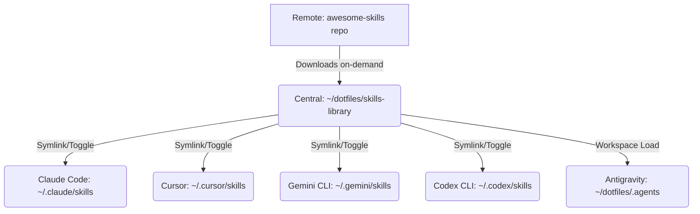

# Spec: Skills Library Management & Interactive CLI Manager

Design specification for cleaning up globally pre-installed skills, creating a centralized, git-tracked `skills-library`, and developing an interactive TUI skill manager using `gum` for multiple AI coding assistants.

## Goal & Scope

Ensure the global `~/.gemini/skills/` directory is clean of unused pre-installed skills. Set up a central local library at `~/dotfiles/skills-library/` for customized and on-demand downloaded skills. Implement an interactive `skill-manager` script to automate installation and toggle activation across multiple CLI environments.

## Proposed System Architecture



## Detailed Component Specifications

### 1. Centralized Workspace Configuration
- Directory: `~/dotfiles/skills-library/`
- Workspace Config: `~/dotfiles/.agents/skills.json`
```json
{
  "entries": [
    { "path": "../skills-library" }
  ]
}
```

### 2. Interactive Skill Manager (`~/dotfiles/bin/skill-manager`)
The bash script will use `gum` to render a Terminal User Interface (TUI):
- **Main Menu Options**:
  1. `🔍 Search & Install Skill (Remote)`
  2. `🛠️ Manage Local Skills (Enable/Disable in CLIs)`
  3. `🧹 Clean Up Global CLI Skills`
  4. `🚪 Exit`
- **Fuzzy Search (Remote)**:
  - Fetches the remote `skills_index.json` list of skills.
  - Passes it to `gum filter` to let the user select a skill.
  - Downloads the selected skill via `git sparse-checkout` to `~/dotfiles/skills-library/<skill-name>`.
- **Checkbox CLI Target Selector**:
  - Displays a checkbox list via `gum choose --no-limit` to choose which target CLIs to symlink to:
    - Claude Code (`~/.claude/skills/`)
    - Cursor (`~/.cursor/skills/`)
    - Gemini CLI (`~/.gemini/skills/`)
    - Codex CLI (`~/.codex/skills/`)
    - Antigravity IDE (`~/dotfiles/.agents/skills/`)
- **Local Skill Management**:
  - Lists directories in `~/dotfiles/skills-library/` via `gum filter`.
  - Determines where they are currently active (checking symlink existence).
  - Presents a checkbox list to enable/disable (create/remove symlinks).

### 3. Global Skill Manager Playbook (`skill-manager/SKILL.md`)
We will create a global skill definition for the manager itself:
- **Path**: `~/dotfiles/skills-library/skill-manager/SKILL.md`
- **Symlinked target directories**:
  - `~/.claude/skills/skill-manager` -> `~/dotfiles/skills-library/skill-manager`
  - `~/.gemini/skills/skill-manager` -> `~/dotfiles/skills-library/skill-manager`
  - `~/.cursor/skills/skill-manager` -> `~/dotfiles/skills-library/skill-manager`
- **YAML Frontmatter**:
```yaml
name: skill-manager
description: Manage and install active agentic skills. Use when the user asks to search, install, list, or enable/disable skills.
---
```
- **Instructions**: Directs the AI to run the command `~/dotfiles/bin/skill-manager` in the terminal when managing skills is requested.

## Verification Plan

### Manual Verification
1. Run `skill-manager` in the terminal.
2. Select `🧹 Clean Up Global CLI Skills` and verify all global awesome-skills are deleted.
3. Select `🔍 Search & Install Skill` and type `karpathy-guidelines` (or `andrej-karpathy`), selecting Claude and Gemini. Verify directories and symlinks are created.
4. Select `🛠️ Manage Local Skills` and verify checkboxes correctly show active/inactive state and toggle symlinks on save.
