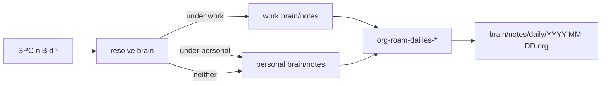

# Org-roam-dailies Design (Emacs)

Date: 2026-07-23

## Motivation

Enable Org-roam’s built-in daily notes (`org-roam-dailies`) as a chronological log / scratchpad inside each second-brain’s roam tree, without changing the existing automated `org-journal` workflow.

Neovim parity is explicitly deferred.

## Goals

- One daily Org-roam file per calendar day under `brain/notes/daily/YYYY-MM-DD.org`
- Support **both** personal and work second-brains
- Context-aware brain selection with a safe personal default
- Fast capture of timestamped log entries
- Keybindings under the existing second-brain leader map (`SPC n B`)
- Leave `org-journal` and Doom’s stock `SPC n r d` bindings untouched

## Non-goals

- Neovim / `org-roam.nvim` dailies
- Structured day templates (Tasks / Journal / Review sections)
- TODO carry-forward from previous days
- Remounting or disabling Doom’s default roam dailies map (`SPC n r d`)
- Filtering dailies out of `org-roam-node-find` or agenda
- Replacing inbox capture (`notes/inbox.org`) or root-level GTD `daily/agenda/` files

## Current state

| Piece | Location / behavior |
|-------|---------------------|
| Org module | `(org +… +journal +roam2 …)` in `init.el` |
| Dual brains | [`+org-second-brain.el`](../../../doom-emacs/.config/doom/+org-second-brain.el) |
| Default `org-directory` | Personal second-brain (`config.el`) |
| Roam notes | `<brain-root>/brain/notes/` (+ dual roam-find helpers) |
| Journal | `org-journal` → `journal/%Y/%m/%d.org` (do not touch) |
| Root `daily/` | GTD/agenda/habits/journal inbox under brain root — **not** roam dailies |
| Dailies config | Not set; package defaults unused in second-brain map |

## Design

### Path layout

```
<brain-root>/
  brain/notes/           ← org-roam-directory
    daily/               ← org-roam-dailies-directory ("daily/")
      2026-07-23.org     ← one node per day
  journal/               ← org-journal (unchanged)
  daily/agenda/          ← GTD (unchanged; different tree)
```

Filename format is fixed to `YYYY-MM-DD.org` (Org-roam calendar marking requirement).

### Brain resolution

When any second-brain dailies command runs:

1. Resolve context file via existing `my/org-second-brain-context-file` / `my/org-second-brain-for-file`
2. If file is under work → `:work`
3. If file is under personal → `:personal`
4. Otherwise → `:personal` (default)

Then `let`-bind (same pattern as roam-find helpers):

- `org-roam-directory` → `<root>/brain/notes`
- `org-roam-db-location` → `<root>/.org-roam.db`

and call the corresponding `org-roam-dailies-*` command.



### Capture template

Bare daily file; no section outline; no filetags.

```elisp
(setq org-roam-dailies-directory "daily/")
(setq org-roam-dailies-capture-templates
      '(("d" "default" entry
         "* %<%H:%M> %?"
         :target (file+head "%<%Y-%m-%d>.org"
                            "#+title: %<%Y-%m-%d>\n"))))
```

- First use of a date creates the file with `#+title: YYYY-MM-DD`
- Later captures append a timestamped heading

### Bootstrap

On load (or first dailies use), ensure these directories exist:

- `~/Projects/Personal/Github/second-brain/brain/notes/daily/`
- `~/Projects/Work/Github/second-brain/brain/notes/daily/`

Use `make-directory … t` (create parents if needed). Idempotent.

### Agenda

No special casing. `brain/` is already in `my/org-second-brain-curated-subdirs`, so recursive scan already includes `brain/notes/daily/*.org`. Leave that behavior as-is.

### Keybindings

Add under `SPC n <my/org-second-brain-leader-key>` (default `B`), prefix `d` (dailies):

| Key | Command wrapper target |
|-----|------------------------|
| `t` | goto today |
| `T` / `n` | capture today |
| `y` | goto yesterday |
| `Y` | capture yesterday |
| `m` | goto tomorrow |
| `M` | capture tomorrow |
| `d` | goto date |
| `D` | capture date |
| `b` | previous daily note |
| `f` | next daily note |
| `-` | find dailies directory |

Update the file header help comment in `+org-second-brain.el` to document `d` dailies.

Leave Doom stock `SPC n r d` alone (continues to use default `org-roam-directory` = personal via `org-directory`).

### File changes

**Modify only:**

- [`doom-emacs/.config/doom/+org-second-brain.el`](../../../doom-emacs/.config/doom/+org-second-brain.el)
  - `after! org-roam`: dailies directory + capture templates + `(require 'org-roam-dailies)`
  - Helpers: ensure-dir, resolve-brain (or reuse), with-roam-brain, thin interactive wrappers
  - `map!` prefix `d` + header comment

**Do not modify:**

- `org-journal` block
- Capture templates for inbox / GTD `daily/agenda/`
- Neovim configs
- Doom module flags in `init.el` (`+roam2` already present)

### Purpose boundaries

| System | Role |
|--------|------|
| org-roam-dailies | Day-scoped log / scratchpad; linkable roam nodes |
| org-journal | Automated journal — leave alone |
| `brain/notes/inbox.org` | Quick inbox capture (`SPC n B c/W/P`) |
| Root `daily/agenda/` | GTD todos / habits |

## Verification

1. Reload Doom / eval `+org-second-brain.el`
2. Outside any brain buffer: `SPC n B d t` creates personal `brain/notes/daily/<today>.org`
3. From a work-brain Org buffer: same key opens/creates work daily
4. `SPC n B d n` appends `* HH:MM` entry
5. Confirm `org-journal` still writes `journal/%Y/%m/%d.org`
6. Confirm Doom `SPC n r d` still works against personal roam

## Implementation plan

See Cursor plan: org-roam-dailies setup (Emacs-only change in `+org-second-brain.el`).
